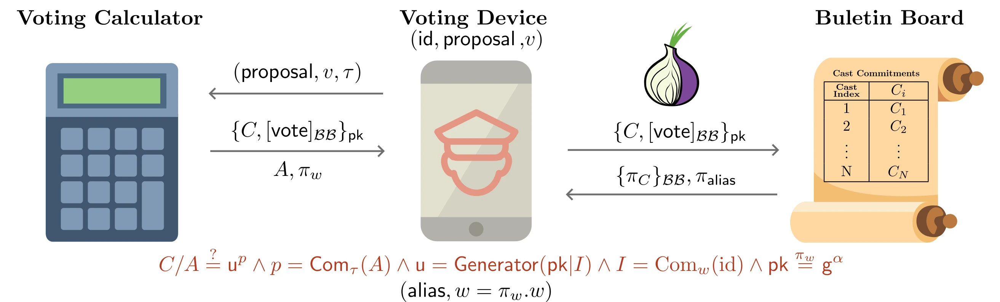

# TallyProofs.jl

[](https://codecov.io/gh/PeaceFounder/TallyProofs.jl)



TallyProofs.jl implements the cryptographic core of a novel electronic voting system that achieves both coercion resistance and end-to-end verifiability. The system's key innovation is its post-cast isolation approach - voters use a calculator device that remains offline between vote casting and verification phases. This design enables voters to verify their votes while maintaining privacy and coercion resistance without requiring complex threshold ceremonies or trust in multiple parties.

The system combines three innovative security mechanisms:
1. A deniable revoting protocol using cast commitments, which allows voters to update their votes without detection while enforcing the bulletin board to reveal the last cast vote
2. A tracker generation system where each voter receives their unique challenge derived from all cast votes, which prevents both tracker prediction before vote closing and prevents an isolated voting calculator from computing any voter's tracker except its own
3. A generator commitment scheme that binds the bulletin board to publish voter's identity commitment next to their vote commitment by encoding it into the generator seed, enabling voters to prove ownership of their used pseudonym and keep their voting device accountable for vote recording without trusting the voting calculator

## Features

- End-to-end verifiability with unconditional individual verifiability
- Coercion resistance through deniable revoting and decoy credentials
- Everlasting privacy via perfectly hiding commitments
- Linear complexity vote tallying with instant results
- Support for vote supersession with paper ballots

## Installation

The package can be added to your Julia environment:

```julia{skip=true}
using Pkg
Pkg.add("https://github.com/PeaceFounder/TallyProofs.jl")
```

TallyProofs.jl is compatible with all Julia-supported platforms (Linux, MacOS, Windows, FreeBSD, etc.). The package has no binary dependencies, and all requirements are handled automatically during installation, ensuring robust operation across environments with minimal maintenance.

## Implementation Scope

This package demonstrates the core cryptographic protocols of the voting system. For clarity and testing purposes, this prototype combines the bulletin board and tallier into a single entity. In a production environment, these would be separate components with distinct responsibilities.

A complete deployment would require additional components:
- Voting calculator firmware running on isolated, tamper-resistant hardware (isolation is sufficient for individual verifiability, whereas tamper resistance is necessary for coercion resistance)
- A voting device application that performs integrity checks and transmits votes via anonymous channels (e.g., Tor)
- An accountable append-only bulletin board system

While implementing these additional components involves primarily standard software engineering practices, proper security implementation requires significant attention to detail and careful system design.

## Guide

### Setup and Initialization

```julia
using CryptoGroups
using SigmaProofs.Verificatum: ProtocolSpec
using TallyProofs

G = @ECGroup{P_192}
g = G()

verifier = ProtocolSpec(; g)

# Tallier Secrets
tallier_key = 453
cast_openings = CastOpening{G}[]

# Public Bulletin Board
pid = 1 # proposal identifier
proposal = Proposal(pid, g, g^tallier_key, verifier; challenge_max=999)
members = G[]
cast_commitments = G[]

# Tallier Controller
function record_vote!(vote)
    alias = findfirst(isequal(vote.signature.pbkey), members)
    @assert !isnothing(alias) "Voter is not a registered member"
    @assert verify(vote, proposal.g) "Signature on the vote envelope invalid"

    cast_opening = extract_opening(vote, proposal, verifier, tallier_key)
    @assert isconsistent(cast_openings, cast_opening) "Cast opening inconsistent with previous cast"

    push!(cast_commitments, vote.C)
    push!(cast_openings, cast_opening)

    return alias, length(cast_commitments)
end
```

We use the `P_192` elliptic curve group from CryptoGroups for this demonstration. In a production environment, this could be replaced with `OpenSSLGroups` elliptic curves for significantly better performance. The system employs the Verificatum verifier specification for shuffle proofs, with additional proofs (Schnorr, Lambda Commitment, and Supersession) built on top following the specification's practices.

The tallying authority maintains the election private key and manages cast vote openings, while the public bulletin board stores the election proposal, member list, and vote commitments. The `record_vote!` function ensures that votes have valid openings and maintains the supersession protocol's integrity, which enforces the publication of the last cast vote. This design prevents vote omission while enabling deniable revoting, as cast commitments don't reveal voter identities.

### Registration 

```julia
# Registration
alice = VotingCalculator(b"Alice", g, verifier, 1234) 
bob = VotingCalculator(b"Bob", g, verifier, 5678)
eve = VotingCalculator(b"Eve", g, verifier, 4321)

append!(members, [g^i.key for i in [alice, bob, eve]]) # registration
```

During registration, each voter receives a voting calculator that generates a secret key using randomness from both the device and additional sources chosen by the voter. This multi-source randomness generation prevents a compromised vendor from breaking vote anonymity through predetermined randomness.

Voters set a PIN code on their calculator which is used for vote sealing, tracker computation, creating decoy credentials, and installing override trackers. The registration process includes publishing the calculator's public key. While this example shows direct registration, in practice the registration authority may require proof that the key is stored on a genuine voting calculator to ensure coercion resistance. Keys can also be braided through an exponentiation mix to provide vote anonymity from the tallier while maintaining eligibility verification.

### Vote Casting

```julia
# Voting Device Controller
function cast_vote!(voter, proposal, selection, pin)
    chg = rand(2:order(G)-1)
    context = assemble_vote!(voter, proposal, selection, chg, pin)
    @assert isconsistent(context, chg, g, voter.hasher, voter.verifier) "Vote is not correctly formed"
    alias, cast_index = record_vote!(context.vote)
    
    return CastReceipt(alias, context.id, seed(context.π_w))
end

# Vote Casting
alice_receipt = cast_vote!(alice, proposal, 3, alice.pin)
bob_receipt = cast_vote!(bob, proposal, 4, bob.pin)
eve_receipt = cast_vote!(eve, proposal, 6, eve.pin)
bob_receipt = cast_vote!(bob, proposal, 1, bob.pin) # anyone can revote
```

The vote casting process demonstrates the system's core security features. The voting device interfaces with the calculator to construct an encrypted and signed vote. Before submission, the device verifies the cast commitment will bind the bulletin board to publish a vote commitment next to the voter's identity commitment. This enables accountability for vote recording without requiring trust in the calculator.

The system supports deniable revoting, as shown when Bob updates his vote. This is crucial for coercion resistance, allowing voters to update their votes without detection. Additionally, if the bulletin board refuses to accept a valid vote, monitors or proxies can enforce inclusion since votes are pseudonymously signed.

### Verification and Tallying

```julia
# Universal Verifiability
simulator = tally(proposal, cast_commitments, cast_openings, verifier)
@assert verify(simulator) "Integrity audit has failed"

# Individual Verifiability
@assert alice_receipt.id == b"Alice" "Cast receipt is not owned"
alice_challenge = get_challenge(simulator.proposition, members, alice_receipt, proposal.hasher)
alice_tracker = compute_tracker(alice, pid, alice_challenge, alice.pin)
N = findfirst(x -> x.display_tracker == alice_tracker, simulator.proposition.tally_board)
@assert simulator.proposition.tally_board[N].selection == 3 "Vote is not cast as intended"

# Counting of the votes
count_votes(simulator.proposition)
```

The tallying process follows a specific sequence to ensure security. First, the system publishes a commitment to the seed used for token derivation, preventing target tracker preimage attacks. The tally board and decoy tracker challenges are then published, followed by individual tracker challenges that enable vote verification.

When verifying their vote, a voter can use their cast receipt to retrieve their token from the bulletin board and verify their identity commitment. By checking that the receipt shows their correct identity, voters can confirm ownership of the pseudonym used to cast their vote. They then enter their token into the voting calculator to compute their tracker, which they use to locate their vote on the tally board.

This verification process is streamlined through a web interface: voters click a link that opens a form pre-filled with their verification parameters, establish an anonymous channel to the bulletin board, verify their identity commitment, and enter their computed tracker to retrieve their vote. The system provides clear accountability - if verification fails, either the voting device or calculator can be identified as the source of the problem.

The system supports vote privacy through several mechanisms, including the ability to handle decoy votes and fake credentials, making it resistant to various forms of coercion. The commitment shuffle provides everlasting privacy, while the supersession protocol ensures votes can't be omitted from the final tally.

### Decoy Votes

The system supports the addition of decoy votes to the tally board by listing vote openings alongside tracker preimage commitments {Q, R} with separate tracker challenges. Voters can manually construct decoy votes using a fake credential approach:

```julia
decoy_pin = 2341
eve_seed = create_decoy_credential!(eve, decoy_pin, 4321)
```

The decoy_pin functions like a regular PIN code, allowing all standard operations including creating additional decoy credentials. When creating a decoy credential, the voter receives a secret seed that determines tracker preimage parameters θ, λ. These parameters can be derived once the proposal is known, enabling tracker computation on an external device after the vote without compromising verifiability:

```julia
decoy_tracker = compute_tracker(proposal, eve_seed, simulator.proposition.decoy_challenge)
```

When a voter casts a vote using a decoy credential, it reaffirms their already-cast vote with their real credential and adds the decoy opening for the cast vote. This mechanism counters scenarios where a coercer might secretly use the voter's calculator without revealing their choice. If no real vote has been cast, the system casts a null vote instead, protecting against forced participation attacks.

### Coercion Resistance

The system's coercion resistance mechanisms would be ineffective against in-person coercion without receipt-freeness. The challenge is that the voting calculator itself could serve as a receipt, as a coercer could input the tracker challenge and verify the correct tracking number.

To address this, the system implements a tracker override mechanism. After verifying their vote with the correct tracker challenge, voters can override the tracker with their preferred vote from the tally board. When the correct tracker challenge is entered, this overridden vote is displayed instead.

```julia
install_decoy_tracker!(eve, pid, decoy_tracker, decoy_pin)
```

To prevent coercers from checking just before voting closes (ensuring they're first to input the tracker challenge), the system releases the tally board with decoy tracker challenges first. This allows voters to select their chosen tracker and set it up, preferably using a decoy credential. The tracker challenges are watermarked with bits from a shared secret, enabling the calculator to identify correct challenges and display the override tracker consistently.

### Skip List

The system supports superseding electronic votes with external voting methods, such as paper ballots. In such cases, voters visit a polling station with their calculator, which proves ownership of their pseudonym by signing to override their cast vote. This generates publicly auditable proofs. The system implements this functionality through a skip list in the tallying process:

```julia
tally(proposal, cast_commitments, cast_openings, verifier; skip_list = members[2:2])
```

The skip_list parameter specifies pseudonyms to exclude from tallying. The verification process remains unchanged, except that the verifier must also check the legitimacy of the skipped list within the proposition.


## Citation

To cite this work, please use:

Erdmanis, J. (2025). *Unconditional Individual Verifiability with Coercion Resistance via Post-Cast Isolation.* Manuscript in preparation.

The paper describing the system's cryptographic protocols and security mechanisms is currently in the draft stage and may change with a more thorough analysis. 
